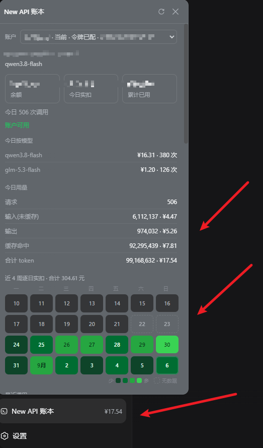

# @loostone/dsh-newapi-wallet

[DeepSeek Harness](https://github.com/deepseek-ai)（DSH）侧边栏的 **New API 网关账本**：显示当前路由在自建 [New API](https://github.com/Calcium-Ion/new-api) 网关上的**今日实际扣费**、按模型拆分（带金额）、输入/输出/缓存分桶金额、**近 4 周逐日消费热力图**与逐条消费明细。

金额**只来自网关账本**，不做本地 `token × 单价` 估算。

## 展示效果

侧边栏底部入口点开即得：余额 / 今日实扣 / 累计、按模型与分桶的 ¥ 金额、近 4 周逐日消费热力图（悬停看单日）、逐条明细。



派生自上游 MIT 项目 `dsh-gateway-wallet`（作者 MuAllen），派生说明与许可见 [NOTICES.txt](NOTICES.txt)，上游 [LICENSE](LICENSE) 全文原样保留。

## 为什么不是本地估算

一条真实调用的输入里通常大部分是**缓存命中**，而缓存命中按 `cache_ratio` 折价计费。用 `prompt + completion × 倍率` 直接乘单价会显著高估实际花费（缓存占比越高，偏差越大）。本插件因此只读网关已经算好的 `quota`，再按网关自身声明的换算常数显示为对应币种。

## 功能

- 侧边栏底部一个入口，徽标直接显示**今日实扣金额**
- 点开面板：余额 / 今日实扣 / 累计已用三卡、**今日按模型拆分（每行带 ¥）**、今日用量分桶（未缓存输入 / 输出 / 缓存命中，每行带对应 ¥ 金额，三行之和恒等于今日实扣）、**近 4 周逐日消费热力图**（颜色深浅 = 当日实扣，格内日号、每月 1 号显示「X月」，悬停弹卡看金额与次数，零消费与「网关没留记录」是两种格子）、最近若干条**逐条消费明细**（模型、单笔金额、token 构成、分组、令牌名）
- 面板顶部一排横向滚动的**供应商卡片**：从 DSH 已配置的模型路由里自动探测出哪些是 New API 站点，**只列这些**，并自动选中当前模型所在的那条；切换卡片即切换账本
- 每张卡片带**「配置令牌」**按钮：在弹窗里填写或修改该供应商的访问令牌，也可勾选「作为所有供应商的默认令牌」，**保存后即时生效，不用重启**
- 唯一入口就是左下角这个「账本」，不往设置页插任何座位
- 按需刷新：只在有会话运行、或面板打开时轮询；空闲且关闭时不发任何请求
- 站点没返回的字段就不显示对应行，并说明原因，不会静默换算成 0

## 安装

开源仓库，**全部写法都不需要 SSH 密钥或登录**（下面每条都在禁用 SSH 的环境里实测通过）：

```sh
# GitHub（推荐）：pnpm 会规范化为 hosted 规格，直接下载匿名 HTTPS tarball 并按 commit SHA 锁定
dsh plugin --profile web add "github:lzd-loostone/dsh-newapi-wallet#v0.1.8"

# 等价的显式 HTTPS git 地址（效果同上，锁文件里仍会记成 hosted 规格）
dsh plugin --profile web add "https://github.com/lzd-loostone/dsh-newapi-wallet.git#v0.1.8"

# 也可以直接给归档 tarball 地址
dsh plugin --profile web add "https://codeload.github.com/lzd-loostone/dsh-newapi-wallet/tar.gz/refs/tags/v0.1.8"

# 或从内部 npm registry
dsh plugin --profile web add @loostone/dsh-newapi-wallet@0.1.8

# 或分发本地 tarball 文件
dsh plugin --profile web add <路径>\loostone-dsh-newapi-wallet-0.1.8.tgz
```

- **请钉 tag 或 commit**（`#v0.1.8`），不要写 `#main`/`#master`：pnpm 会把 tag 解析成具体 commit 并把 `codeload` 的 SHA 地址写进 `pnpm-lock.yaml`，同事之间装到的字节完全一致。
- 预构建产物 `lib/` 已入库，所以**安装不触发任何构建脚本**，也不会被 pnpm 的构建脚本策略拦截。
- 零运行时依赖。
- 用本地 `.tgz` 安装时注意：pnpm 会把它记成 `file:` 依赖，**装完那个文件不能删也不能挪**，否则以后每次 `dsh plugin` / `pnpm install` 都会因解析不到路径而失败。上面的 URL 方式无此约束。
- 装完或卸载后**需要重启 DSH**：bundle 只在启动时挂载，只刷新页面会因为 client roster 过期而白屏。

卸载：

```sh
dsh plugin --profile web remove @loostone/dsh-newapi-wallet
```

本插件不写任何私有数据文件；令牌通过宿主设置服务存储（见下），卸载后那条配置行可在设置界面或手工删除。

## 配置

New API 网页端 **个人设置 → 访问令牌** 生成一串（**不是** `sk-` 开头的模型调用密钥）。

面板顶部每张供应商卡片上点**「配置令牌」**填写或修改；弹窗里可以勾选「作为所有供应商的默认令牌」。保存走宿主设置服务的官方写入口（`settings.update`），**即时生效，不用重启**——值落在当前 profile 的 `cordis.patch.yml` 里本插件条目的 `config` 下：

```yaml
- id: loostone-newapi-wallet
  name: '@loostone/dsh-newapi-wallet'
  config:
    routeAccessTokens:      # 可选：按 DSH 路由分别覆盖
      '<路由名>': '<该路由使用的访问令牌>'
    accessToken: '<所有路由的默认访问令牌>'
    refreshMs: 60000        # 可选：自动刷新间隔，实际夹在 [10s, 10min]
```

⚠️ 访问令牌以**明文**存在该文件里，请按密码对待：不要提交到仓库、不要贴进聊天或工单。未配置令牌时对应卡片会标注「未配令牌」并给出配置按钮，而不是显示 0 假装正常。

网关地址与模型调用密钥仍来自 DSH 原有的 LLM 路由配置，本插件不复制一份、也不写回。

## 计费口径

不同 New API 实例的换算常数不一样，所以**运行时从网关 `/api/status` 读取**，不写死：

```
显示金额 = quota / quota_per_unit × usd_exchange_rate      （币种取 quota_display_type）
quota    = (未缓存输入 + 缓存命中 × cache_ratio + 输出 × completion_ratio) × model_ratio × group_ratio
```

面板上的每一笔金额都来自网关已经记账的 `quota`。分桶金额（未缓存输入 / 输出 / 缓存命中）的口径：`/api/log/self` 的每条账单在 `other` 字段里**自带这笔实际使用的比例**（`model_ratio` / `completion_ratio` / `cache_ratio` / `group_ratio`），先按比例算出三个分量，再按该行真实 `quota` 等比回缩——分量之和恒等于账本金额。**不请求价目接口，也不做本地估价。**

## 使用的接口

| 接口 | 凭据 | 用途 |
| --- | --- | --- |
| `/api/status` | 匿名 | 读取换算常数与站点信息；同时是唯一的网关类型探针 |
| `/api/user/self` | 访问令牌 | 账户、余额、累计用量 |
| `/api/log/self/stat` | 访问令牌 | 今日实扣；热力图「今天」格与 data/self 缺口日的逐日补探 |
| `/api/data/self` | 访问令牌 | 今日按模型拆分；近 4 周逐日金额（小时行按本地日期聚合） |
| `/api/log/self` | 访问令牌 | 逐条消费明细；输入/输出/缓存分桶金额（全天分页聚合） |

网关类型识别只靠匿名 `/api/status`：New API 会正常返回站点信息，其他中转站不会。探测结果按 origin 缓存，**非 New API 的模型路由不会出现在卡片列表里**（若一条都没探出来，面板会列出每条路由的失败原因）。本插件不调用任何 token 级接口，因此不受那类接口限流影响。

## 开发

```sh
npm i --no-save --prefix .build-deps esbuild
node scripts/build.mjs        # 生成 lib/index.js 与 lib/client.js(+map)
DSH_TEST_TOKEN=<访问令牌> DSH_TEST_ORIGIN=<网关地址> node test/harness.mjs
```

`test/harness.mjs` 不启动 DSH：用最小假 Cordis 上下文加载构建产物，走完「`settings.describe()` 读路由 → 探出 New API → 取令牌 → 请求网关 → 回环路由出账本 / 写令牌」全链路，并断言响应体不含任何凭据。它需要两个环境变量，仓库里不含任何真实地址或密钥。

接口上有两个实测坑（代码里已带防线，改取数逻辑时别退回）：`/api/log/self` 的翻页参数是 **`p`**——这个 fork 会**静默无视 `page`** 并反复返回第一页（曾把全天聚合放大 10 倍）；`/api/data/self` 的窗口上限是一个月（30 天），热力图取 28 天恰好覆盖。

构建上有两处不能图省事：`@deepseek-ai/schemastery` 与其依赖必须**内联**进宿主半（宿主环境不提供）；前端 bundle 的 `__ModuleLoader__` id 必须等于**包名**。`scripts/build.mjs` 已经处理好，别退回上游的 `--external:@deepseek-ai/*`。

客户端半刻意**不 import 任何 Harness Client 包**（图标与「点面板外面收起」都是自实现），所以 `dsh.client.inject` 是空数组：那里填的是「本 bundle 运行时会 `require` 的裸模块名」，不是「用到的契约包」。产物只 require `react` 与 `react/jsx-runtime`。

## 排错

- **卡片列表里没有我的网关**：候选来自「DSH 已配置的模型路由」∩「匿名探测出是 New API 的站点」。路由没配 `baseURL`，或站点没有可用的 `/api/status`，都不会出现；面板会把被滤掉的路由和原因列出来。
- **保存令牌报 403 / 415**：写接口只接受同源回环请求，且要求 `Content-Type: application/json`（跨站页面发不出来，浏览器预检也会被挡掉）。本插件的只读路由同样只接受来自本机的请求。
- **改了 `dsh.client.inject` 或装卸插件后前端无变化**：需要重启 DSH（见上）。
- **金额与站点不一致**：先核对 `/api/status` 的 `quota_per_unit` / `usd_exchange_rate` / `quota_display_type` 是否被本插件读到；读不到时面板会说明而不是猜。
- **面板显示 forbidden**：本插件的路由只接受来自本机的请求。若你的 DSH 后端不是跑在本机，需要改走宿主 RPC。

## 已知限制

- 只统计经过网关的模型调用；网关未记账的请求不在内。金额以网关账本为准，不构成对账凭证。
- 访问令牌是用户级的：看到的是该令牌所属账户的花费，不是整组总额（需要组总额请用管理账户的令牌）。
- 逐条明细与 DSH 本地消息目前按时间 + 模型对应，尚未与 `request_id` 严格绑定。
- 热力图的逐日数据以网关统计表的保留范围为准：超出覆盖的天显示「无数据」（虚线格），与「零消费」（浅灰格）严格区分，不会混为一谈。
- 同一个网关上的多条模型路由会各自成为一张卡片（内容相同），目前不按 origin 合并。
- New API 若改版接口字段，对应行留空并说明原因，不会静默换算。

## 许可与免责声明

MIT。上游 `dsh-gateway-wallet` 的 MIT 许可与版权声明完整保留于 [LICENSE](LICENSE)。

本软件按「现状」提供，与 DeepSeek、New API 及各中转服务无隶属或背书关系，作者不对使用本插件造成的损失承担责任。
